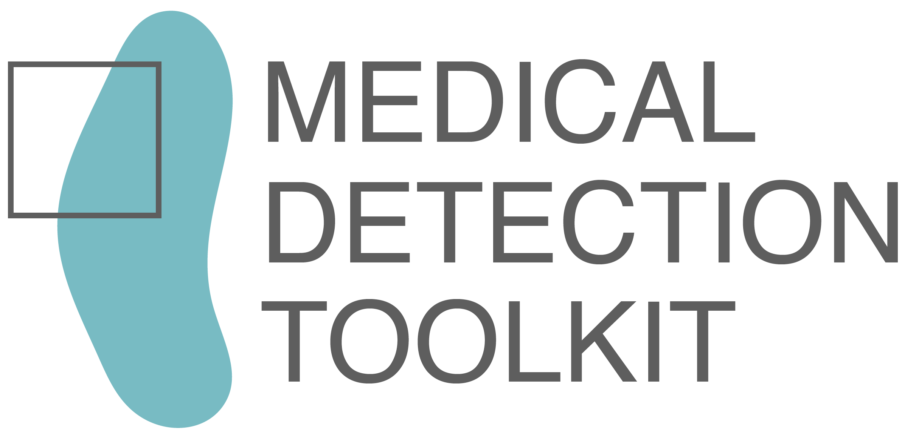
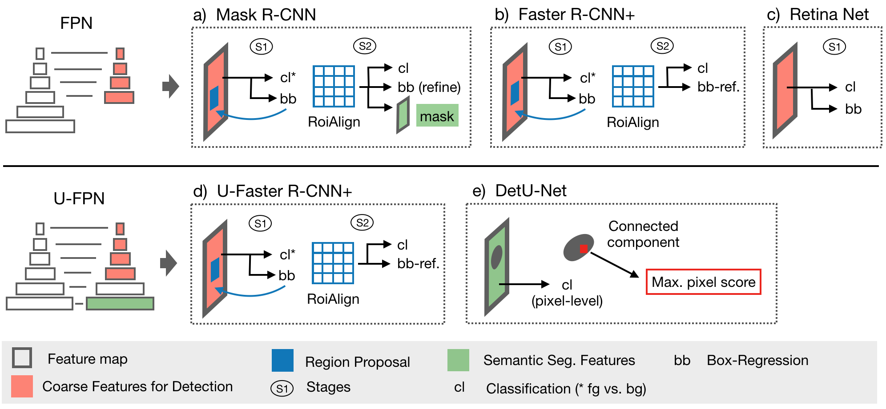
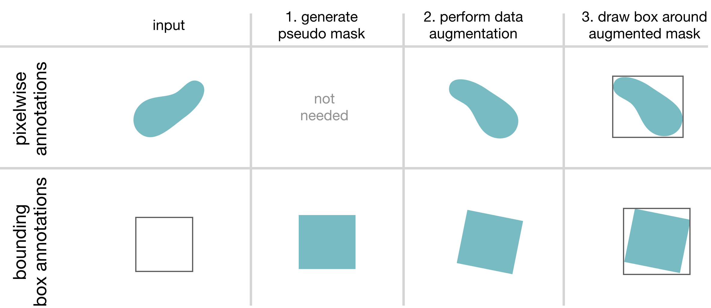
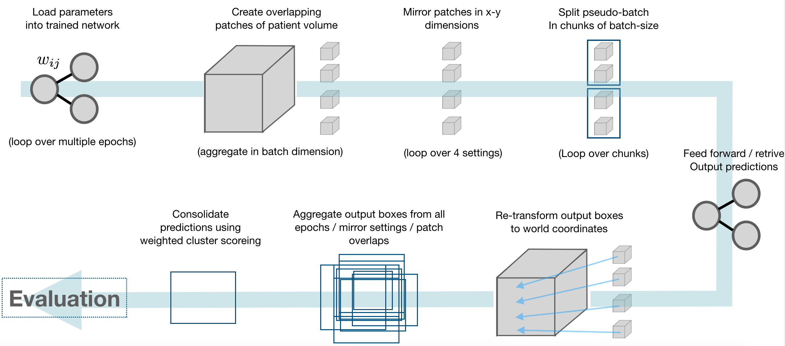
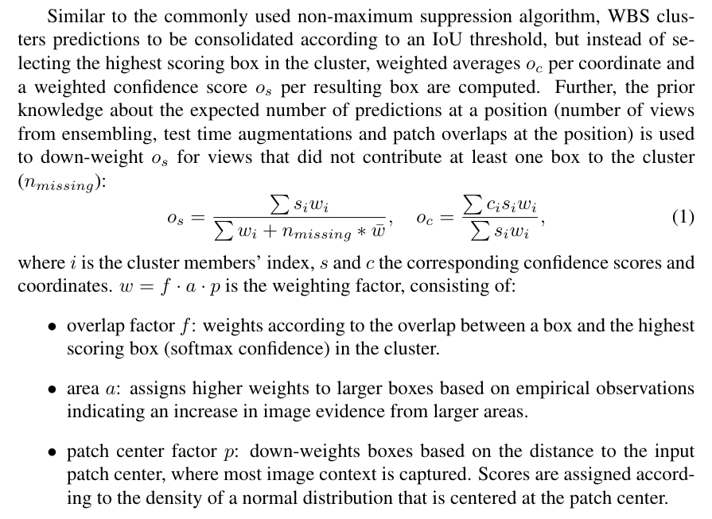
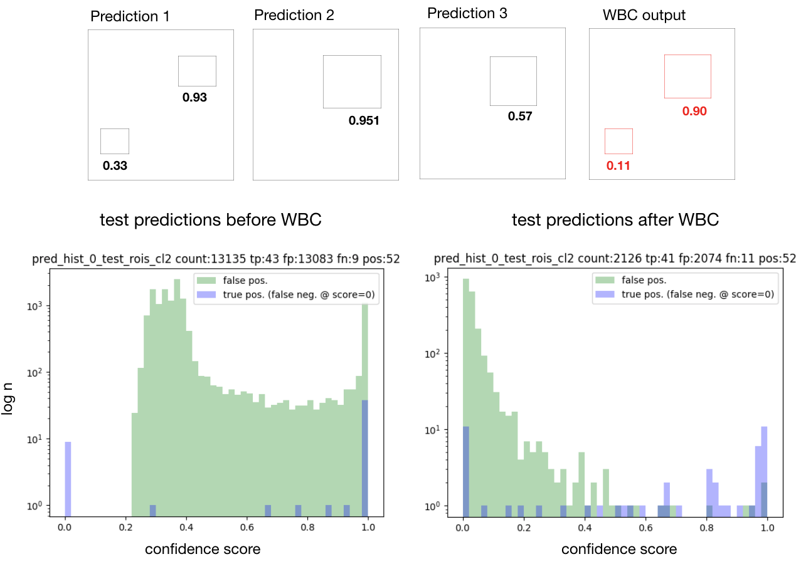
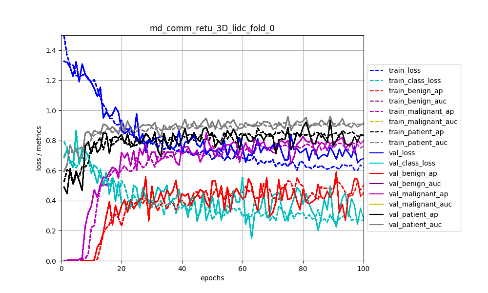
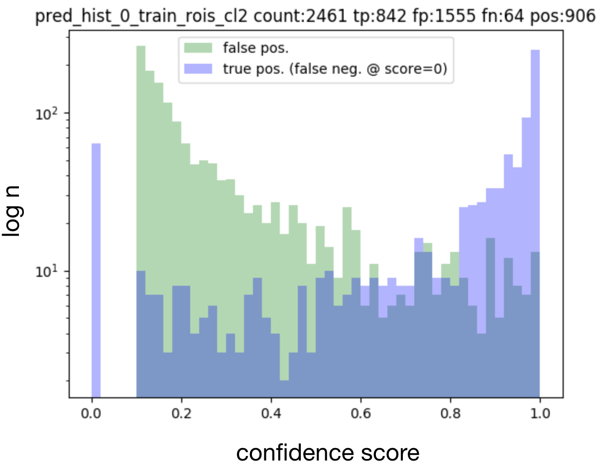
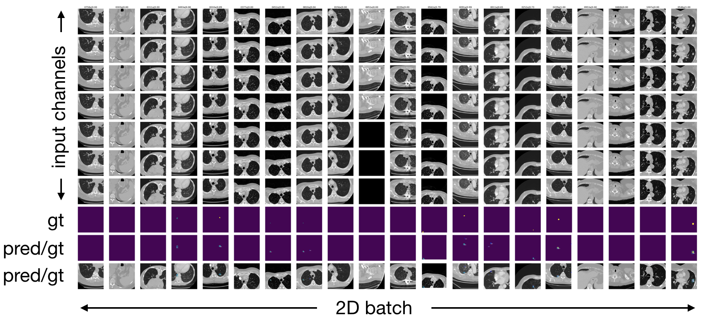

[](https://join.slack.com/t/mdtoolkit/shared_invite/enQtNTQ3MjY2MzE0MDg2LWNjY2I2Njc5MTY0NmM0ZWIxNmQwZDRhYzk2MDdhM2QxYjliYTcwYzhkNTAxYmRkMDA0MjcyNDMyYjllNTZhY2M)
<p align="center"></p><br>

Copyright © German Cancer Research Center (DKFZ), <a href="https://www.dkfz.de/en/mic/index.php">Division of Medical Image Computing (MIC)</a>. Please make sure that your usage of this code is in compliance with the code <a href="https://github.com/pfjaeger/medicaldetectiontoolkit/blob/master/LICENSE">license</a>.  

## Release Notes
**v0.1.0**: 
- Updates to python 3.7, torch 1.4.0, torchvision 0.5.0, entailing a change in custom extensions NMS and RoIAlign 
        (now in C++ and CUDA).
- Scalar monitoring is changed to torch-included tensorboard. 
- Added qualitative example plots for validation and testing. 
- Default optimizer is changed to AdamW instead of Adam to account for fix in weight-decay handling, 
norms and biases can optionally be excluded from weight decay. 
- Introduced optional dynamic learning-rate scheduling. 
- A specific CUDA device can now be selected via script argument.
- Inside the models, GT class labels identification is changed from `'roi_labels'` to `'class_target'` to streamline naming scheme.
- Added dataset [tutorial](experiments/tutorial.md).

**v0.0.2**: Small fixes mainly regarding server-env settings (cluster deployment).\
**v0.0.1**: Original framework as used for the corresponding paper, with Python 3.6 and torch 0.4.1 dependencies, 
        custom extensions NMS and RoIAlign in C and CUDA, scalar monitoring via plot files.
        
## Overview
This is a comprehensive framework for object detection featuring:
- 2D + 3D implementations of prevalent object detectors: e.g. Mask R-CNN [1], Retina Net [2], Retina U-Net [3]. 
- Modular and light-weight structure ensuring sharing of all processing steps (incl. backbone architecture) for comparability of models.
- training with bounding box and/or pixel-wise annotations.
- dynamic patching and tiling of 2D + 3D images (for training and inference).
- weighted consolidation of box predictions across patch-overlaps, ensembles, and dimensions [3].
- monitoring + evaluation simultaneously on object and patient level. 
- 2D + 3D output visualizations.
- integration of COCO mean average precision metric [5]. 
- integration of MIC-DKFZ batch generators for extensive data augmentation [6].
- easy modification to evaluation of instance segmentation and/or semantic segmentation.
<br/>
[1] He, Kaiming, et al.  <a href="https://arxiv.org/abs/1703.06870">"Mask R-CNN"</a> ICCV, 2017<br>
[2] Lin, Tsung-Yi, et al.  <a href="https://arxiv.org/abs/1708.02002">"Focal Loss for Dense Object Detection"</a> TPAMI, 2018.<br>
[3] Jaeger, Paul et al. <a href="http://arxiv.org/abs/1811.08661"> "Retina U-Net: Embarrassingly Simple Exploitation
of Segmentation Supervision for Medical Object Detection" </a>, 2018

[5] https://github.com/cocodataset/cocoapi/blob/master/PythonAPI/pycocotools/cocoeval.py<br/>
[6] https://github.com/MIC-DKFZ/batchgenerators<br/><br>

A tutorial on how to add your own data set can be found under [`experiments/tutorial.md`](experiments/tutorial.md).

## How to cite this code
Please cite the original publication [3].

## Installation
Setup package in virtual environment
```
git clone https://github.com/MIC-DKFZ/medicaldetectiontoolkit.git.
cd medicaldetectiontoolkit
virtualenv -p python3.7 mdt
source mdt/bin/activate
python setup.py install
```
##### Custom Extensions
This framework uses two custom mixed C++/CUDA extensions: Non-maximum suppression (NMS) and RoIAlign. Both are adapted from the original pytorch extensions (under torchvision.ops.boxes and ops.roialign).
The extensions are automatically compiled from the provided source files under medicaldetectiontoolkit/custom_extensions with above setup.py. 
However, the extensions need to be compiled specifically for certain GPU architectures. Hence, please ensure that the architectures you need are included in your shell's
environment variable ```TORCH_CUDA_ARCH_LIST``` before compilation. 

Example: You want to use the modules with the new TITAN RTX GPU, which has 
Compute Capability 7.5 (Turing Architecture), but sometimes you also want to use it with a TITAN Xp (6.1, Pascal). Before installation you need to
```export TORCH_CUDA_ARCH_LIST="6.1;7.5"```. A link list of GPU model names to Compute Capability can be found here: https://developer.nvidia.com/cuda-gpus. 
Note: If you'd like to import the raw extensions (not the wrapper modules), be sure to import torch first.


## Prepare the Data
This framework is meant for you to be able to train models on your own data sets. 
Two example data loaders are provided in medicaldetectiontoolkit/experiments including thorough documentation to ensure a quick start for your own project. The way I load Data is to have a preprocessing script, which after preprocessing saves the Data of whatever data type into numpy arrays (this is just run once). During training / testing, the data loader then loads these numpy arrays dynamically. (Please note the Data Input side is meant to be customized by you according to your own needs and the provided Data loaders are merely examples: LIDC has a powerful Dataloader that handles 2D/3D inputs and is optimized for patch-based training and inference. Toy-Experiments have a lightweight Dataloader, only handling 2D without patching. The latter makes sense if you want to get familiar with the framework.).

## Execute
1. Set I/O paths, model and training specifics in the configs file: medicaldetectiontoolkit/experiments/your_experiment/configs.py
2. Train the model: 

    ```
    python exec.py --mode train --exp_source experiments/my_experiment --exp_dir path/to/experiment/directory       
    ``` 
    This copies snapshots of configs and model to the specified exp_dir, where all outputs will be saved. By default, the data is split into 60% training and 20% validation and 20% testing data to perform a 5-fold cross validation (can be changed to hold-out test set in configs) and all folds will be trained iteratively. In order to train a single fold, specify it using the folds arg: 
    ```
    python exec.py --folds 0 1 2 .... # specify any combination of folds [0-4]
    ```
3. Run inference:
    ```
    python exec.py --mode test --exp_dir path/to/experiment/directory 
    ```
    This runs the prediction pipeline and saves all results to exp_dir.
    
    
## Models

This framework features all models explored in [3] (implemented in 2D + 3D): The proposed Retina U-Net, a simple but effective Architecture fusing state-of-the-art semantic segmentation with object detection,<br><br>
<p align="center"></p><br>
also implementations of prevalent object detectors, such as Mask R-CNN, Faster R-CNN+ (Faster R-CNN w\ RoIAlign), Retina Net, U-Faster R-CNN+ (the two stage counterpart of Retina U-Net: Faster R-CNN with auxiliary semantic segmentation), DetU-Net (a U-Net like segmentation architecture with heuristics for object detection.)<br><br><br>
<p align="center"></p><br>

## Training annotations
This framework features training with pixelwise and/or bounding box annotations. To overcome the issue of box coordinates in 
data augmentation, we feed the annotation masks through data augmentation (create a pseudo mask, if only bounding box annotations provided) and draw the boxes afterwards.<br><br>
<p align="center"></p><br>


The framework further handles two types of pixel-wise annotations: 

1. A label map with individual ROIs identified by increasing label values, accompanied by a vector containing in each position the class target for the lesion with the corresponding label (for this mode set get_rois_from_seg_flag = False when calling ConvertSegToBoundingBoxCoordinates in your Data Loader).
2. A binary label map. There is only one foreground class and single lesions are not identified. All lesions have the same class target (foreground). In this case the Dataloader runs a Connected Component Labelling algorithm to create processable lesion - class target pairs on the fly (for this mode set get_rois_from_seg_flag = True when calling ConvertSegToBoundingBoxCoordinates in your Data Loader). 

## Prediction pipeline
This framework provides an inference module, which automatically handles patching of inputs, and tiling, ensembling, and weighted consolidation of output predictions:<br><br><br>
<br><br>


## Consolidation of predictions (Weighted Box Clustering)
Multiple predictions of the same image (from  test time augmentations, tested epochs and overlapping patches), result in a high amount of boxes (or cubes), which need to be consolidated. In semantic segmentation, the final output would typically be obtained by averaging every pixel over all predictions. As described in [3], **weighted box clustering** (WBC) does this for box predictions:<br>
<p align="center"><br><br></p>
<p align="center"><br><br></p>


## Visualization / Monitoring
By default, loss functions and performance metrics are monitored:<br><br><br>
<br>
<hr>
Histograms of matched output predictions for training/validation/testing are plotted per foreground class:<br><br><br>

<hr>
Input images + ground truth annotations + output predictions of a sampled validation abtch are plotted after each epoch (here 2D sampled slice with +-3 neighbouring context slices in channels):<br><br><br>

<hr>
Zoomed into the last two lines of the plot:<br><br><br>


## License
This framework is published under the [Apache License Version 2.0](LICENSE).


